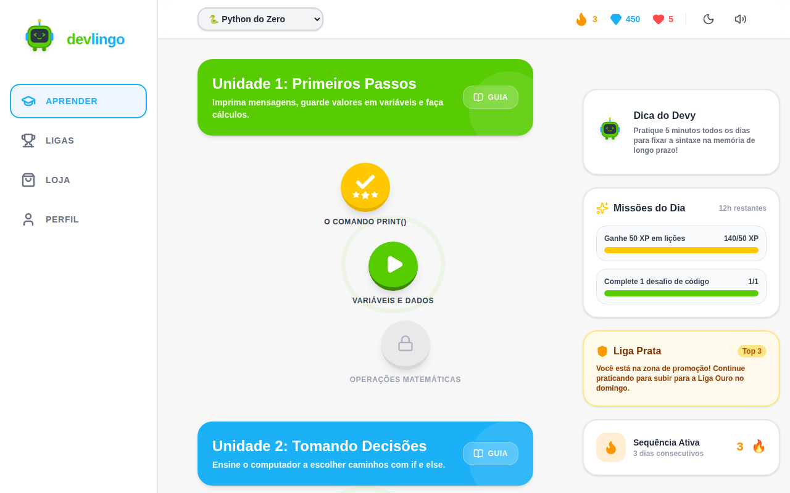

# Devlingo 🤖

Plataforma gamificada para aprender programação no estilo Duolingo, com trilhas de Python e JavaScript, desafios interativos, XP, vidas, sequência de dias, ligas e loja.

**[Ver online](https://devlingo-dusky.vercel.app)**

| Trilha de aprendizado | Lição |
| --- | --- |
|  |  |

## Funcionalidades

- **Trilhas por linguagem:** "Python do Zero" e "JavaScript Moderno", divididas em unidades e lições que vão sendo desbloqueadas
- **5 tipos de desafio:**
  - múltipla escolha
  - completar a lacuna
  - achar o bug
  - montar o código na ordem certa (Parsons)
  - escrever e rodar código no navegador
- **Execução de código no navegador:** o JavaScript roda num escopo isolado com o `console` capturado; o Python usa o Pyodide quando ele está carregado e, sem ele, um interpretador simples de `print`, variáveis e contas
- **Gamificação:** XP, vidas, gemas, sequência de dias com proteção (freeze), missões diárias e conquistas
- **Ligas e loja:** ranking semanal com zona de promoção e itens para comprar com gemas
- **Tema claro e escuro e efeitos sonoros**

## Tecnologias

- React 19 + TypeScript + Vite
- Tailwind CSS 4
- Zustand para o estado do jogo
- React Router
- Framer Motion, canvas-confetti e Howler para animações e sons
- Supabase (opcional) para login e progresso salvo na nuvem
- Oxlint

## Como rodar

```bash
git clone https://github.com/yangabriel-dev/Devlingo.git
cd Devlingo
npm install
npm run dev
```

Sem configurar nada, o app roda em **modo local**, com os dados de exemplo de `src/data/mockData.ts`.

Para usar o Supabase, copie o `.env.example` para `.env`, preencha `VITE_SUPABASE_URL` e `VITE_SUPABASE_ANON_KEY` e rode o `supabase/schema.sql` no SQL Editor do seu projeto. O arquivo cria as tabelas de perfis, cursos, unidades, lições, desafios e progresso.

| Comando | O que faz |
| --- | --- |
| `npm run dev` | roda em modo de desenvolvimento |
| `npm run build` | checa os tipos e gera o build em `dist/` |
| `npm run preview` | serve o build localmente |
| `npm run lint` | roda o Oxlint |

## Estrutura

```
src/
├── pages/          # Aprender, Lição, Ligas, Loja e Perfil
├── components/
│   ├── lesson/     # um componente para cada tipo de desafio
│   ├── roadmap/    # trilha, unidades e nós das lições
│   ├── layout/     # cabeçalho, menu lateral e layout
│   └── mascot/     # o Devy, mascote do app
├── store/          # estado do jogo com Zustand
├── lib/            # executor de código, sons e cliente do Supabase
├── data/           # cursos, lições e dados de exemplo
└── types/          # tipos do domínio
supabase/
└── schema.sql      # banco de dados completo
```

## Autor

Feito por **Yan Gabriel** · [LinkedIn](https://www.linkedin.com/in/yangabrieldev/) · [GitHub](https://github.com/yangabriel-dev)
